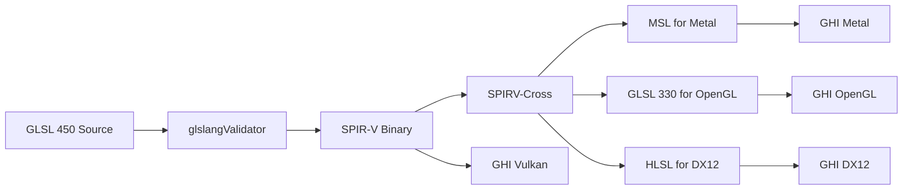

# Jupiter Shader Workflow with SPIRV-Cross

## Overview

Jupiter uses **SPIRV-Cross** to support multiple backends from a single shader codebase.

**Write once:** GLSL 450 (Vulkan)  
**Compile to:** MSL (Metal), GLSL 330/410 (OpenGL), HLSL (DX12)

**Source:** https://github.com/KhronosGroup/SPIRV-Cross

---

## Shader Pipeline



---

## Workflow

### 1. Write GLSL 450 (Vulkan)

**Source:** `rendering/shaders/simple/simple.vert`

```glsl
#version 450

layout(location=0) in vec3 inPosition;
layout(location=1) in vec3 inNormal;
layout(location=2) in vec2 inTexCoord;

layout(set=0, binding=0) uniform CameraUBO {
    mat4 view;
    mat4 projection;
} camera;

layout(push_constant) uniform ObjectPC {
    mat4 model;
} object;

layout(location=0) out vec3 fragNormal;
layout(location=1) out vec2 fragTexCoord;

void main() {
    vec4 worldPos = object.model * vec4(inPosition, 1.0);
    gl_Position = camera.projection * camera.view * worldPos;
    fragNormal = mat3(object.model) * inNormal;
    fragTexCoord = inTexCoord;
}
```

### 2. Compile to SPIR-V

```bash
glslangValidator -V simple.vert -o simple.vert.spv
glslangValidator -V simple.frag -o simple.frag.spv
```

**Output:** `simple.vert.spv`, `simple.frag.spv` (SPIR-V binaries)

### 3. Cross-Compile to Other Backends

**Automated via GHI:**

```cpp
// GHI automatically converts at runtime
ghi::initialize(ghi::Backend::Metal);

// GHI detects backend and converts SPIR-V → MSL
auto shader = ghi::createShader({
    .vertexPath = "simple.vert.spv",  // SPIR-V input
    .fragmentPath = "simple.frag.spv"
});
// SPIRV-Cross converts to MSL internally
```

**Manual conversion (build time):**

```bash
# SPIR-V → MSL (Metal)
spirv-cross simple.vert.spv --msl --output simple.vert.metal

# SPIR-V → GLSL 330 (OpenGL)
spirv-cross simple.vert.spv --version 330 --no-es --output simple.vert.glsl

# SPIR-V → HLSL SM 6.0 (DX12)
spirv-cross simple.vert.spv --hlsl --shader-model 60 --output simple.vert.hlsl
```

### 4. Result: Multi-Backend Shaders

**From one GLSL source, get:**
- ✅ `simple.vert.spv` (Vulkan - SPIR-V)
- ✅ `simple.vert.metal` (Metal - MSL)
- ✅ `simple.vert.glsl` (OpenGL - GLSL 330)
- ✅ `simple.vert.hlsl` (DX12 - HLSL)

**All functionally identical!**

---

## SPIRV-Cross Integration in GHI

### Runtime Conversion (Flexible)

```cpp
// GHI Metal backend
ShaderHandle GHI_MetalBackend::createShader(const ShaderSource& source) {
    if (source.vertexPath) {
        // Load SPIR-V file
        std::vector<uint32_t> spirv = loadSPIRV(source.vertexPath);
        
        // Cross-compile to MSL
        std::string mslSource = spirvToMSL(source.vertexPath);
        
        // Compile MSL with Metal
        MTL::Library* library = compileMetalSource(mslSource);
        // ...
    }
}
```

**Pros:**
- Flexible, single shader source
- No pre-compilation needed
- Easy iteration

**Cons:**
- Conversion happens at runtime (slower startup)
- Needs SPIRV-Cross linked

### Build-Time Conversion (Optimized)

```cmake
# CMakeLists.txt
function(cross_compile_shader SHADER_FILE)
    get_filename_component(SHADER_NAME ${SHADER_FILE} NAME_WE)
    
    # GLSL → SPIR-V
    add_custom_command(
        OUTPUT ${SHADER_NAME}.spv
        COMMAND glslangValidator -V ${SHADER_FILE} -o ${SHADER_NAME}.spv
        DEPENDS ${SHADER_FILE}
    )
    
    # SPIR-V → MSL (for Metal)
    add_custom_command(
        OUTPUT ${SHADER_NAME}.metal
        COMMAND spirv-cross ${SHADER_NAME}.spv --msl --output ${SHADER_NAME}.metal
        DEPENDS ${SHADER_NAME}.spv
    )
    
    # SPIR-V → GLSL 330 (for OpenGL)
    add_custom_command(
        OUTPUT ${SHADER_NAME}.glsl
        COMMAND spirv-cross ${SHADER_NAME}.spv --version 330 --no-es --output ${SHADER_NAME}.glsl
        DEPENDS ${SHADER_NAME}.spv
    )
endfunction()

# Cross-compile all shaders
cross_compile_shader(shaders/simple/simple.vert)
cross_compile_shader(shaders/simple/simple.frag)
```

**Pros:**
- Pre-compiled, fast loading
- No runtime conversion overhead
- Smaller binary (no SPIRV-Cross)

**Cons:**
- More build complexity
- Need to maintain shader variants

---

## Recommended Workflow for Jupiter

**Hybrid Approach:**

1. **Author:** Write GLSL 450 (Vulkan-style)
2. **Build:** Compile to SPIR-V with glslangValidator
3. **Runtime:** GHI uses SPIRV-Cross to convert as needed
4. **Optimize:** Pre-compile for shipping builds

**Example structure:**
```
shaders/
├── source/                # Author shaders here (GLSL 450)
│   ├── simple.vert
│   └── simple.frag
├── spirv/                 # Build output (SPIR-V)
│   ├── simple.vert.spv
│   └── simple.frag.spv
└── compiled/              # Runtime cross-compiled (cached)
    ├── metal/
    │   ├── simple.vert.metal
    │   └── simple.frag.metal
    ├── opengl/
    │   ├── simple.vert.glsl
    │   └── simple.frag.glsl
    └── dx12/
        ├── simple.vert.hlsl
        └── simple.frag.hlsl
```

---

## SPIRV-Cross Benefits for Jupiter

### Single Shader Source

**Write once:**
```glsl
// simple.vert (GLSL 450)
#version 450
layout(set=0, binding=0) uniform CameraUBO { ... } camera;
layout(push_constant) uniform ObjectPC { ... } object;
```

**Get automatically:**
```metal
// simple.metal (MSL) - via SPIRV-Cross
#include <metal_stdlib>
struct CameraUBO { ... };
[[buffer(0)]] constant CameraUBO& camera,
[[buffer(1)]] constant ObjectPC& object
```

```glsl
// simple.glsl (GLSL 330) - via SPIRV-Cross
#version 330
layout(std140) uniform CameraUBO { ... } camera;
uniform ObjectPC { ... } object;
```

### Descriptor Set Remapping

SPIRV-Cross can remap descriptor sets/bindings:

```cpp
// Metal doesn't have descriptor sets, remap to buffer indices
spirv_cross::CompilerMSL msl(spirv);

// Set 0, Binding 0 → Buffer 0
// Set 0, Binding 1 → Buffer 1
// Set 1, Binding 0 → Buffer 10
msl.add_msl_resource_binding({
    .stage = spv::ExecutionModelVertex,
    .desc_set = 0,
    .binding = 0,
    .msl_buffer = 0
});
```

### Automatic Reflection

```cpp
spirv_cross::Compiler compiler(spirv);
auto resources = compiler.get_shader_resources();

// Extract all uniform buffers
for (auto& ubo : resources.uniform_buffers) {
    uint32_t set = compiler.get_decoration(ubo.id, spv::DecorationDescriptorSet);
    uint32_t binding = compiler.get_decoration(ubo.id, spv::DecorationBinding);
    // Auto-create descriptor set layouts!
}
```

---

## Integration with GHI

### GHI Shader Creation

```cpp
// Application code (backend-agnostic)
auto shader = ghi::createShader({
    .vertexPath = "simple.vert.spv",    // SPIR-V input
    .fragmentPath = "simple.frag.spv"
});

// GHI Metal backend internally:
// 1. Loads SPIR-V
// 2. Calls spirvToMSL()
// 3. Compiles MSL with Metal
// 4. Creates MTL::RenderPipelineState

// GHI Vulkan backend internally:
// 1. Loads SPIR-V directly
// 2. Creates VkShaderModule
// 3. No conversion needed

// GHI OpenGL backend internally:
// 1. Loads SPIR-V
// 2. Calls spirvToGLSL()
// 3. Compiles GLSL with OpenGL
// 4. Creates GL shader program
```

---

## Examples

### Simple Triangle (Cross-Platform)

**Write once:** `triangle.vert` (GLSL 450)
```glsl
#version 450
layout(location=0) in vec2 inPos;
layout(location=1) in vec3 inColor;
layout(location=0) out vec3 fragColor;

void main() {
    gl_Position = vec4(inPos, 0.0, 1.0);
    fragColor = inColor;
}
```

**Auto-converts to MSL:**
```metal
vertex Varyings vertexMain(Vertex in [[stage_in]]) {
    Varyings out;
    out.position = float4(in.inPos, 0.0, 1.0);
    out.fragColor = in.inColor;
    return out;
}
```

**Auto-converts to GLSL 330:**
```glsl
#version 330
in vec2 inPos;
in vec3 inColor;
out vec3 fragColor;

void main() {
    gl_Position = vec4(inPos, 0.0, 1.0);
    fragColor = inColor;
}
```

### PBR Shader (Cross-Platform)

**Write once** in GLSL 450 with descriptor sets.
**SPIRV-Cross** converts descriptor sets → buffer indices (Metal), binding points (OpenGL), etc.

All backends get identical PBR functionality!

---

## Benefits for Landscape Demo

**Current problem:** Writing Metal, Vulkan, AND OpenGL shaders separately.

**With SPIRV-Cross:**
1. Write grass compute shader once (GLSL 450)
2. Auto-convert to Metal compute (MSL)
3. Auto-convert to OpenGL compute (GLSL 430)

**Single codebase, all backends!**

Same for:
- Terrain shaders
- Grass vertex shader
- Trail compute shader
- PBR lighting

---

## CMake Integration

```cmake
# Add SPIRV-Cross
add_subdirectory(vendored/spirv-cross)

# Link to rendering library
target_link_libraries(rendering PRIVATE
    spirv-cross-core
    spirv-cross-glsl
    spirv-cross-msl
    spirv-cross-hlsl
)

# Include headers
target_include_directories(rendering PRIVATE
    ${CMAKE_SOURCE_DIR}/vendored/spirv-cross
)
```

---

## Status

**SPIRV-Cross:** ✅ Vendored at `/vendored/spirv-cross/`  
**GHI Integration:** ✅ API defined (`ghi_shader_cross.h/cpp`)  
**Shader Workflow:** ✅ Documented  
**CMake Build:** ⏳ Needs integration  
**Testing:** ⏳ Needs validation with actual shaders

**Next:** Integrate into GHI backends to auto-convert shaders at runtime or build-time.


